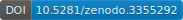

```{r, child="_setup.Rmd"}
```
<div class="DOI">
  [](http://doi.org/10.5281/zenodo.3355292)
</div>

***

# Introduction #

`DNAmArray` is a comprehensive and modular workflow for the pre-processing, quality control, and analysis of DNA methylation (DNAm) array data, tailored for large-scale epigenome-wide association studies (EWAS). It integrates best practices in the field with in-house developed tools, and has been informed by almost a decade of research using the [Biobank-based Integrative Omics Study (BIOS) consortium](https://www.bbmri.nl/samples-images-data) data. The BIOS dataset combines blood-based DNAm and gene expression from across six Dutch biobanks and around 4,000 individuals, and has been used to extensively advance our understanding of epigenetic regulation and health<sup>1-8</sup>.

The workflow combines a series of convenient [**DNAmArray**](https://github.com/molepi/DNAmArray) functions with [BioConductor](https://www.bioconductor.org) packages, including: 

* [**minfi**](https://bioconductor.org/packages/release/bioc/html/minfi.html) for reading in IDAT files and normalization<sup>9</sup>, 
* [**MethylAid**](https://www.bioconductor.org/packages/release/bioc/html/MethylAid.html) for sample-level quality control<sup>10</sup>, 
* [**bacon**](https://bioconductor.org/packages/release/bioc/html/bacon.html) for controlling bias and inflation in EWAS test statistics<sup>11</sup>, and 
* [**omicsPrint**](https://bioconductor.org/packages/release/bioc/html/omicsPrint.html) for identifying and resolving sample mismatches<sup>12</sup>. 

While thoroughly validated on DNAm data profiled using the Illumina Infinium HumanMethylation450 and EPIC arrays, notes within this documentation also outline any changes needed to apply `DNAmArray` to Infinium MethylationEPIC v2.0 BeadChip data. In addition, any dependencies should be installed automatically, but otherwise please refer to the relevant package's documentation (and let us know by opening a GitHub [issue](https://github.com/molepi/DNAmArray/issues)!)

In conclusion, `DNAmArray` provides a scalable, reproducible, and EWAS-ready framework for DNA methylation data analysis, compatible with evolving technologies and suitable for integration with downstream follow-up analyses.

***

# Example Data #

The [example data](https://www.ncbi.nlm.nih.gov/geo/query/acc.cgi?acc=GSE116339)<sup>13</sup> used in this workflow is available from the [NCBI Gene Expression Omnibus](https://www.ncbi.nlm.nih.gov/geo/) (GEO), a public repository of microarray data. It contains genome-wide DNA methylation data from whole blood obtained using the Illumina Infinium MethylationEPIC BeadChip microarray. The participants consist of 679 children exposed to polybrominated biphenyl (PBB), an endocrine-disrupting compound, which was accidentally added to the food supply in Michigan in the 1970s.

***

